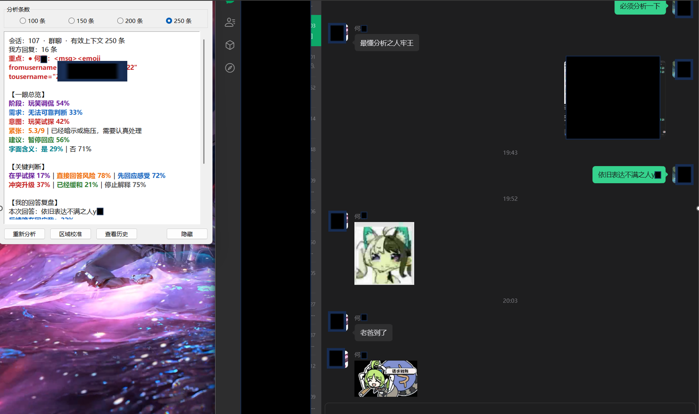
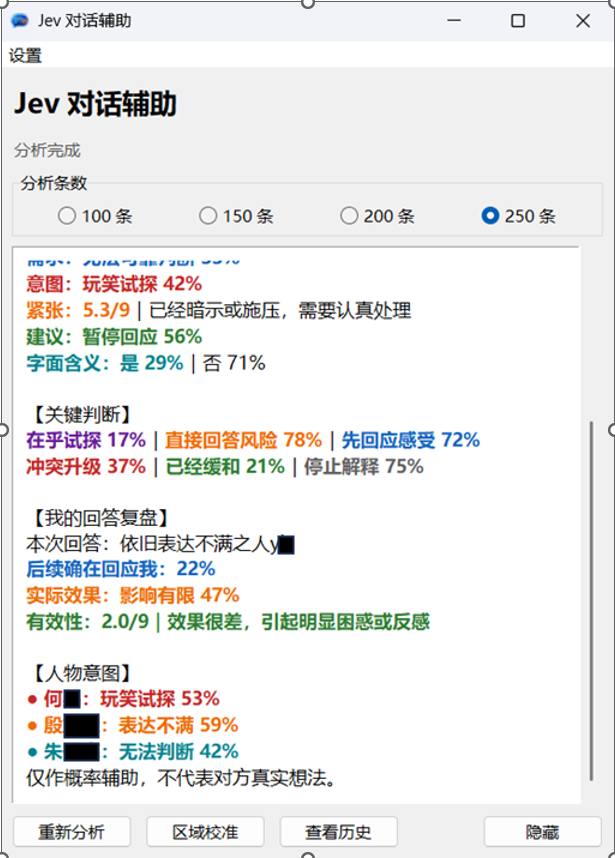
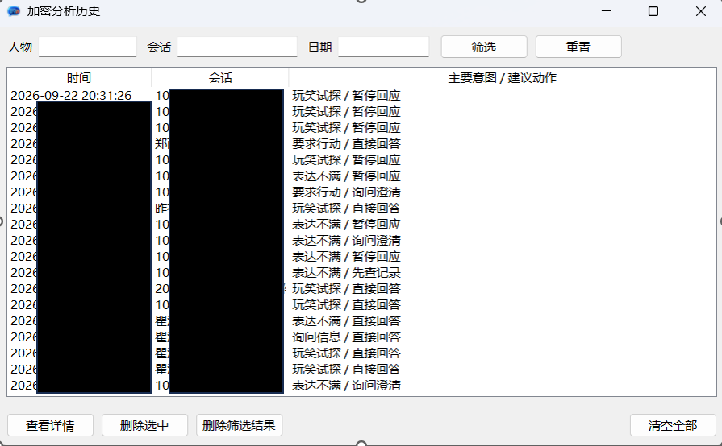
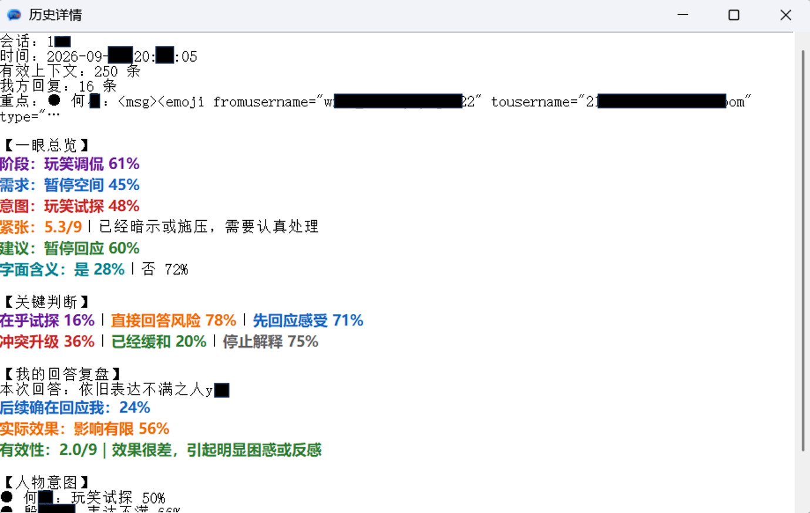

# 微信 Jev 对话助手

一个 Windows 桌面辅助工具：读取当前微信会话的本地文字记录，脱敏后调用 TypeSafe Jev，给出对话阶段、需求、意图、紧张程度、建议动作和回答复盘。

当前稳定版：**v0.3.0**

## 界面示意

以下四张为 **v0.2.1 旧版界面参考**，用于说明主界面、分析结果和历史记录的基本布局。v0.3.0 已新增候选回复开关、彩色候选项和“暂不回应”候选，实际界面会与旧图有差异；新版界面示意图后续补充。

### 主界面与聊天对照（v0.2.1）



### 分析结果（v0.2.1）



### 历史筛选（v0.2.1）



### 历史详情（v0.2.1）



## v0.3.0 重点更新

- 动画表情只向 TypeSafe 提交“[动画表情]”，不再提交原始 XML。
- 支持识别微信引用回复，并以「回复正文 + 被引用原文」参与分析；普通链接、文件和卡片仍会被排除。
- 分析任务在后台执行；连续触发时只排队保留最新请求，旧任务结果不会覆盖新会话。
- 主界面一级开关可选生成 3 条文字回复，默认关闭；另固定追加“暂不回应｜先观察对方后续”作为第 4 个行动候选，四项统一由 Jev 排序。推荐项以绿色显示，其余项用蓝色、紫色、橙色区分；程序不会填入微信或自动发送。
- 会话名和人物昵称在外发前匿名化为“当前群聊/当前私聊、成员A/成员B”。
- 不再向 TypeSafe 提交 wxid、数据库消息ID、会话ID或时间戳。
- 旧历史中的表情 XML 在界面展示时自动折叠，避免再次暴露内部身份字段。
- 清除测试中的真实联系人姓名；README 中保留的旧界面示意图统一标注为 v0.2.1。

## v0.2.0 重点更新

- UIA 优先识别当前会话标题，OCR 仅作兜底；聊天正文只从本地只读数据库获取。
- 使用数据库会话 ID 和消息 ID 隔离、去重并增量合并会话，降低串会话风险。
- 群成员名称按“备注昵称 > 群昵称 > 微信昵称”显示；备注名与群昵称不同时同时保留。
- 文字与动画表情参与分析，图片、语音、视频和文件不提交。
- 主窗口直接切换 100、150、200、250 条分析档位。
- 统计我方回复，并结合后续回应评估实际效果。

## 隐私边界

- API Key 只从 `TYPESAFE_API_KEY` 环境变量读取，不写入源码、数据库或日志。
- 候选回复的起草 API Key 使用 Windows DPAPI 加密保存在本机；也可临时使用 `DRAFT_API_KEY` 环境变量覆盖。
- 起草接口与 TypeSafe 都只接收脱敏后的对话；正文中出现的已知昵称也会替换为成员代号。
- 本地聊天历史使用 AES-GCM 加密，密钥由 Windows DPAPI 绑定当前用户。
- 手机号、邮箱、身份证号、银行卡号和 URL 查询参数在发送前本地脱敏。
- 发送给 TypeSafe 的会话名和人物昵称统一替换为“当前群聊/当前私聊、成员A/成员B”；不发送 wxid、消息ID或时间戳。
- 动画表情只发送“[动画表情]”占位，不发送包含 fromusername、tousername 的原始 XML。
- 截图只用于识别当前会话标题，不保存到磁盘。
- 数据库桥接器只加载固定版本的 `wechatauto/db.py`，禁止发送、监听、UIA 热激活、媒体下载和密钥文件写出。
- `data/`、`logs/`、`.venv/`、数据库临时目录和上游完整源码均被 Git 忽略。

> 本工具会把脱敏后的对话文本发送给 TypeSafe API；开启候选回复后，还会将最近最多 30 条脱敏消息发送给起草服务。自动脱敏不能识别正文中所有身份线索，请仅分析有权处理的会话。关闭候选开关后不会发起新的起草请求，已发送的请求无法撤回。

## 安装

要求：Windows、微信桌面版、Python 3.12、Git。

完整步骤见：[部署指南](content/0922_部署指南_v1.md)。

推荐从 [Releases](https://github.com/yushen100/wechat-jev-assistant/releases) 下载经过校验的 Windows ZIP；自动化部署也可使用 GitHub Packages 中的 `WechatJevAssistant` NuGet 包。

```powershell
Set-ExecutionPolicy -Scope Process Bypass
.\setup.ps1
```

然后在当前 Windows 用户环境变量中设置 `TYPESAFE_API_KEY`，双击 `0921_启动微信Jev助手_v1.cmd`。

候选回复为可选功能且默认关闭：先打开“设置 → 候选回复设置”，填写 OpenAI 兼容接口的 API Key、地址和模型，再在主界面一级区域勾选“启用候选回复生成”。推荐 DeepSeek，默认模型为 DeepSeek-V4.1-Flash（`deepseek-flash`），官方地址为 `https://api.deepseek.com/chat/completions`。仅开关开启时才调用起草模型，候选起草使用非思考模式。API Key 使用 Windows DPAPI 加密，不写入 `config.json`。

## 使用

1. 打开目标微信聊天并保持在前台。
2. 按 `Ctrl+Alt+J`。
3. 在主窗口选择 100、150、200 或 250 条，助手识别当前会话标题后从本地数据库读取对应数量的文字与动画表情并分析。
4. 开启候选回复后，最多 3 条文字建议与额外的“暂不回应｜先观察对方后续”一起参与 Jev 推荐；“复制候选”只复制文字，“采用暂停回应”只提示当前无需发送。
5. 历史数据仅保存在本机加密数据库中。

## 测试

```powershell
.\.venv\Scripts\python.exe -m unittest discover -s tests -p "test_*.py" -q
```

## 第三方依赖

只读数据库适配依赖 `fanyuantaier/wechatauto-replica` 的固定提交。`setup.ps1` 会下载该版本；其源码和许可证归上游项目所有，不会复制进本仓库。
